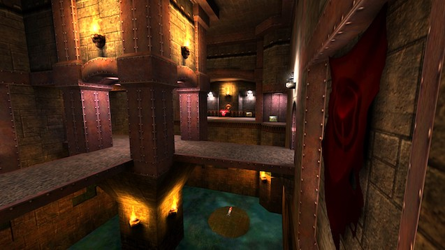

# Example map pool

This example map pool demonstrates how to create an evolved `mappool.txt` file.

*Note: Introduce your map pool file here.*

## Based on file

https://github.com/quakelive-server-standards/quakelive-server-standards/blob/64ba2cc89ce67cd4d0496c3390127a006c64e384/mappools/standard/duel/mappool.txt

*Note: You do not need to base your `mappool.txt` on any file but you can base it either on one of the [standards](https://github.com/quakelive-server-standards/quakelive-server-standards/tree/master/mappools/standard) or on one of the [evolutions](https://github.com/quakelive-server-standards/quakelive-server-standards/tree/master/mappools/evolved).*

*Note: If you base you map pool on an existing file then you need to state it here. Refer to that file by using a link which references a specific Git commit. You can get such a link by opening the file you want to refer to on the GitHub website. Then click on history at the top right side. Find the commit you want to refer to (usually the one on the top) and click the button with that file icon. Its tooltip will display the message "View at this point in the history". Now copy the link from the browser address bar.*

## Evolutions

*Note: List the maps that you added or changed in an alphabetical order. Use the correct Markdown headline level 4 by using `####`.*

#### Beatbox

This map is a solid classic and should belong to a Duel map pool.

Workshop id: [539421606](https://github.com/quakelive-server-standards/quakelive-server-standards/blob/b5d3892e657e27139c4dd6f35ea6d8043271b7dc/workshop/evolved/_example/workshop.txt)

*Note: Add a Level shot. The file location of that image must the [`workshop/_images`](https://github.com/quakelive-server-standards/quakelive-server-standards/tree/master/workshop/_images) directory. The image itself is part of a Workshop item list and had to be added when that item list started to reference that map.*

*Note: Underneath describe why you added that map.*

*Note: Either you are referencing a map that is part of the original Quake Live dedicated server installation or you are referencing a map that has to be added as a Steam Workshop item before it can be played. In the latter case you must add a link to an existing [Workshop item list](https://github.com/quakelive-server-standards/quakelive-server-standards/tree/master/workshop). This link must reference a specific Git commit. You can get such a link by opening the file you want to refer to on the GitHub website. Then click on history at the top right side. Find the commit you want to refer to (usually the one on the top) and click the button with that file icon. Its tooltip will display the message "View at this point in the history". Now copy the link from the browser address bar.*

## History

*Note: Work in versions which increment with every change. Start at version 1. State what you have added or removed.*

### Version 2

*Note: Put a new version above the version before.*

### Version 1

#### Add: Beatbox

This map is a solid classic and should belong to a Duel map pool.

Workshop id: [539421606](https://github.com/quakelive-server-standards/quakelive-server-standards/blob/b5d3892e657e27139c4dd6f35ea6d8043271b7dc/workshop/evolved/_example/workshop.txt)

*Note: Just repeat the information from above but leave out the level shot. This repetition is for documenting the value and the reason for it because it might be changed or removed in the future.*

#### Remove: Bloodrun

If they can play on Beatbox by ztn there is no need to play on Bloodrun by ztn anymore.

*Note: State maps that you removed. Underneath describe why you removed it.*